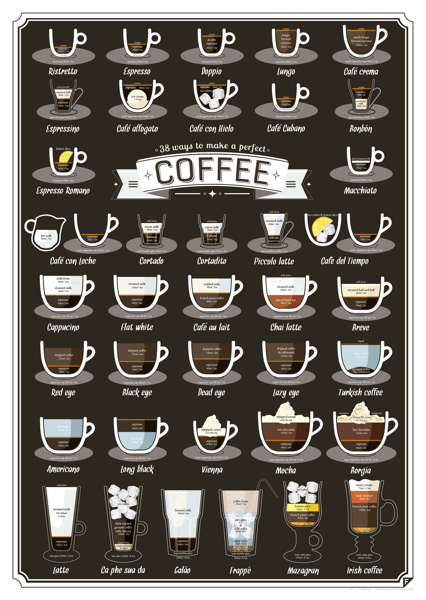

## So, what makes the best coffee? 

* Recall from our analysis on the ratings dataset, we found that the variables flavor, aftertaste, balance, and sweetness, all have a relatively important contribution to how professionals rate the score of coffee varieties. 
  * This implies that rather than only paying attention to simple tastes like sweetness and acidity, professional coffee commentators emphasize more on the comprehensive flavor of the coffee, and lay eyes on more complex aspects like the coffee's aftertaste. 
  
* Then, the analysis on the survey dataset implies that, regular people who consider themselves to be coffee experts would prefer coffee that are less bitter but more acidic, and this choice varies based on the people's other characteristics, such as age and preferred coffee style. 
  * This finding aligns well with that from the ratings analysis, as both the professional ratings and the civilian survey show that people who hold a deeper understanding in coffee would like a less bitter and more flavored coffee.
  * Interestingly, this analysis also discovers that young people are more likely to develop a taste for coffee that integrates other falvors, such as the fruity-flavored Coffee D. 
  
* In general, while some people may think coffee "experts" being more able to drink bitter and strong coffee, our research suggests the opposite -- you don't need to like bitter drinks to taste good coffee! After all, everyone's preference is still based their own choice. 

## Potential future analysis

* Exploring how popularity of different coffees change over time.
* How professionals and regular people react to the same variety of coffee?
* How does coffee ratings change based on the geographical origin of the coffee bean?

